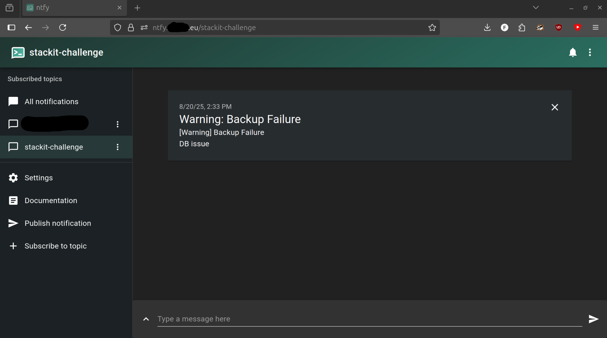
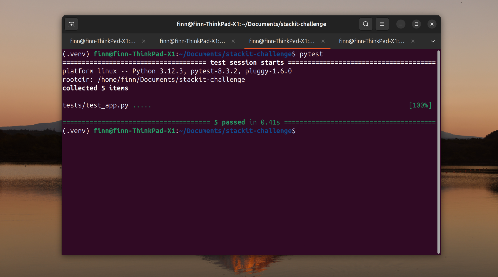
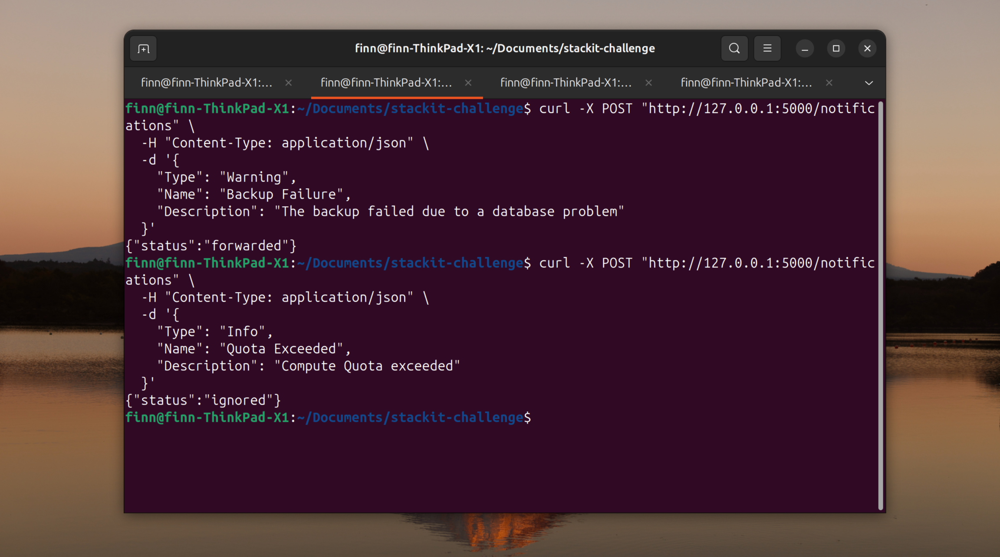

# STACKIT Coding-Challenge – REST API

Minimale REST API:
- `POST /notifications` nimmt JSON entgegen
- **Warning** → via ntfy weitergeleitet
- **Info** → nicht weitergeleitet
- Speicherung: In-Memory
- Tests: pytest (5 passed)

## Setup
```bash
python3 -m venv .venv
source .venv/bin/activate
pip install -r requirements.txt
```

## Start
```bash
python app.py  # http://127.0.0.1:5000
```

## Demo
```bash
curl -X POST http://127.0.0.1:5000/notifications \
  -H "Content-Type: application/json" \
  -d '{"Type":"Warning","Name":"Backup Failure","Description":"DB issue"}'
  ```

## Tests
```bash
pytest -q  
  ```

## Messenger
Für das Weiterleiten der Benachrichtigungen wird **ntfy** verwendet.  
Der ntfy-Server läuft separat auf meinem privaten VPS in einem Docker-Container.  
Ein eigenes Topic wurde für die Challenge eingerichtet.

## Screenshots

### Warning im ntfy-Topic


### Erfolgreiche Tests mit pytest


### curl-Requests (forwarded / ignored)

